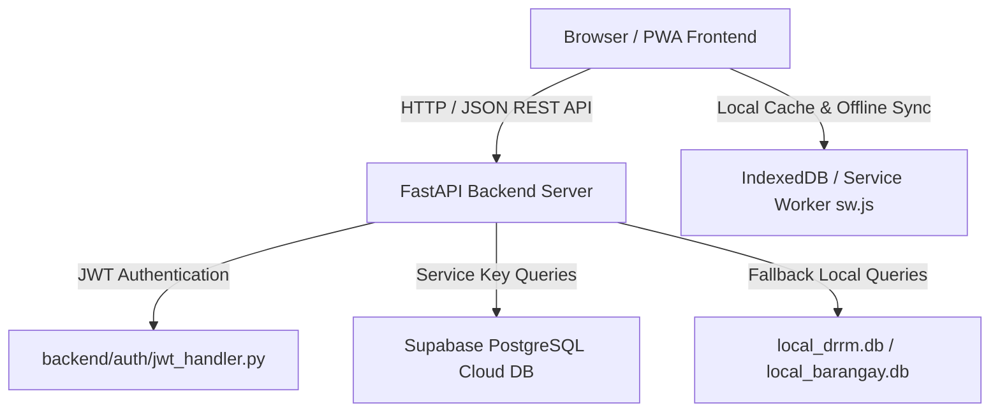

# Barangay DRRM System Architecture & Engineering Blueprint

Smart Geographic Information System (GIS) for Barangay Linao, Ormoc City.

---

## 1. Core System Architecture



---

## 2. Directory Structure & Single Responsibility Mapping

| Path | Primary Responsibility | Key Files / Dependencies |
| :--- | :--- | :--- |
| `backend/main.py` | Application Entry Point & Router Registration | Registers 18 domain routers, CORS middleware |
| `backend/config.py` | Environment Configurations | SUPABASE_URL, SUPABASE_SERVICE_KEY, JWT Secret |
| `backend/database.py` | Database Client Singleton | Supabase Python Client initialization |
| `backend/auth/` | Authentication & Token Verification | `jwt_handler.py`, `dependencies.py` |
| `backend/routes/` | REST API Endpoints (Sub-Domains) | 18 specialized router files |
| `frontend/` | HTML Views & PWA Manifest | `index.html`, `dashboard.html`, `map.html`, `sw.js` |
| `frontend/assets/css/` | Master Styling & UI Tokens | `style.css` |
| `frontend/assets/js/` | Client-Side Controller Logic | `api.js`, page-specific JavaScript modules |
| `supabase/` | Database Schemas & Initial Data | `schema.sql`, `seed.sql` |

---

## 3. Backend Routes Breakdown (`backend/routes/`)

Each route file strictly handles a single functional area:

| Route File | Domain | Key Operations |
| :--- | :--- | :--- |
| `auth_routes.py` | User Authentication | Login, Register, Refresh Token, MFA / Password Reset |
| `dashboard_routes.py` | Executive Overview | Metrics summary, recent alerts, status counters |
| `incident_routes.py` | Incident Management | Log, view, update, and categorize disaster incidents |
| `evacuation_routes.py` | Evacuation Center | Center capacities, status, occupancy tracking |
| `evac_tracking_routes.py` | Evacuee Logs | Resident check-in/check-out logs, family counts |
| `resource_routes.py` | Logistics & Inventory | Relief goods, equipment tracking, distribution |
| `map_routes.py` | Spatial GIS Data | Layer endpoints, marker locations, hazard polygons |
| `reports_routes.py` | Analytics & Reports | PDF/CSV generation, summary reports |
| `risk_routes.py` | Risk Assessment | Risk matrix, vulnerability scores |
| `directory_routes.py` | Emergency Contacts | Hotline directory, responder contacts |
| `asset_routes.py` | Municipal Assets | Vehicles, heavy machinery, static assets |
| `manual_fallback_routes.py` | Offline Sync Handling | Sync queue processing for offline operations |
| `data_management_routes.py`| Data Maintenance | Backup, export, import tables |
| `validation_routes.py` | Integrity Verification | COA audit compliance, validation checks |
| `system_routes.py` | System Diagnostics | Health checks, system logs, version info |
| `support_routes.py` | Help & Ticketing | Support tickets, user guides, FAQ |
| `maintenance_routes.py` | Database Maintenance | Vacuum, reset, database maintenance tasks |
| `demo_routes.py` | Demonstration Setup | Demo data generation for defense showcases |

---

## 4. Frontend Architecture & JS Modules

The frontend follows a **Decoupled Controller Pattern**:

- **Centralized API Helper (`api.js`)**: Handles standard `fetch` execution, authorization headers (`Bearer <token>`), base URL configuration, and error toasts.
- **Component Loader (`components.js`)**: Enforces Single Source of Truth for shared UI layout elements (`sidebar`, `topbar`, `footer`) dynamically across all HTML pages.
- **Service Worker (`sw.js` & `sw-register.js`)**: Intercepts requests for offline caching and Progressive Web App functionality.
- **Page Modules**:
  - `map.js`, `map-layers.js`, `map-manage.js`: Leaflet.js map rendering, dynamic overlays, and marker controls.
  - `dashboard.js`: Real-time telemetry, charts, and metrics update.
  - `evacuation.js`: Evacuation center monitoring and occupant counters.
  - `incidents.js`: Incident reporting form logic and dynamic table rendering.
  - `resources.js`: Inventory management and relief distribution tracking.
  - `reports.js`: Exporting analytics and filtered audit logs.
  - `i18n.js`: Multi-language localization (English / Bisaya / Tagalog).

---

## 5. Software Engineering Guidelines for Developers & AI

To maintain high code quality and fast execution, strictly adhere to these rules when contributing to this codebase:

1. **Keep Routes Slim**: Routes should handle input validation, call service logic, and return responses. Database query helpers or complex algorithms belong in separate utility functions.
2. **Never Duplicate Fetch Logic**: All API calls from the frontend MUST use `api.js` (`API.get()`, `API.post()`, `API.put()`, `API.delete()`).
3. **Preserve Response Formats**: Standardize API JSON output:
   ```json
   {
     "status": "success",
     "data": {},
     "message": "Optional informative message"
   }
   ```
4. **CSS Token Usage**: Always use standard CSS variables defined in `style.css` (e.g. `var(--primary-color)`, `var(--bg-dark)`) instead of ad-hoc hex colors.
5. **Offline First Compliance**: Write interactive features so they fail gracefully or queue updates to IndexedDB when network connectivity is lost.
